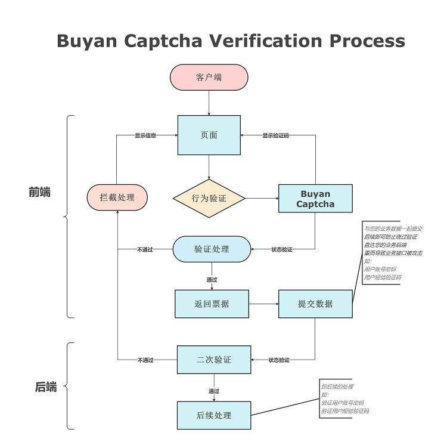
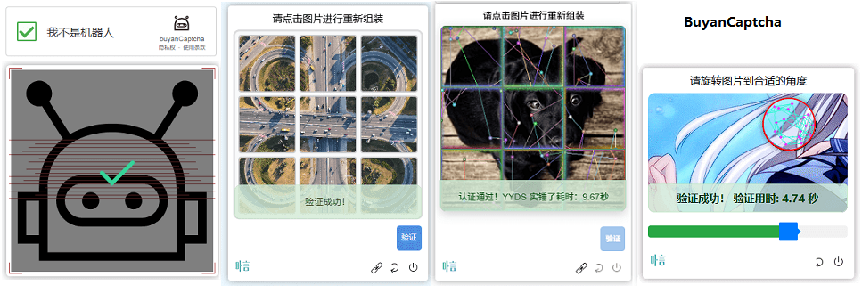

# Buyan-Captcha

## 简介

Buyan-Captcha 是一个行为验证组件，提供智能风控能力，降低短信、登入接口等场景的自动化攻击风险，保护业务数据。

## 核心优势

不同于传统验证码仅判断用户验证结果是否正确，Buyan-Captcha 采用**多层次智能风控体系**，在验证过程中实时分析并识别风险：

### 多维度风险识别

结合以下多维度信息实时识别风险，有效区分真人用户与自动化攻击程序：

- **IP 画像**：分析 IP 地址的历史行为、地理位置、代理/VPN 检测等
- **设备指纹**：采集设备硬件信息、浏览器特征，建立唯一设备标识
- **黑卡检测**：识别已知的恶意设备、IP 黑名单
- **威胁情报**：实时更新的全球威胁情报数据库
- **行为数据**：分析用户的行为轨迹、陀螺仪、点击模式、操作习惯等全部的行为特征

### 智能决策引擎

- **自研大模型决策引擎**：基于深度学习的风险决策模型，持续学习进化
- **打码检测**：精准识别打码平台、人工打码服务等绕过手段
- **实时风险评分**：毫秒级完成风险评估与决策

### 动态对抗增强

当识别到欺诈行为或可疑攻击时，系统自动增强防护等级：

- **图像对抗**：动态增加验证难度，如更复杂的拼图、旋转角度
- **工作量对抗**：提高验证计算量，增加机器破解成本
- **行为对抗**：引入更多行为检测点，让模拟行为更难通过

这种**智能自适应**机制让攻击者成本急剧上升，同时确保正常用户的流畅体验。

## 交互流程



验证流程说明：

1. 用户点击登入或发送验证码按钮，发送请求并显示行为验证码
2. 用户按照提示要求完成验证
3. 验证成功后执行后续的回调
4. 验证票据随回调提交到您的后台，**后台调用 Buyan-Captcha 做二次校验**
5. 返回校验通过或失败结果到应用后端，再返回到前端

> ⚠️ **重要提示**：前端验证成功后**必须**将验证票据提交到您的后台，由后台调用 Buyan-Captcha 服务做二次校验。**仅依靠前端验证结果无法确保验证可信**，攻击者可能绕过前端直接调用接口。二次校验是保障业务安全的必要环节。

## 特性

### 智能风控

- 结合IP画像、设备指纹、黑卡检测、威胁情报、行为数据等多维度信息实时识别风险
- 自研大模型决策引擎、打码检测
- 识别到欺诈行为自动增强图像对抗、工作量对抗、行为对抗

### 多端适配

- ✔️ Web/H5
- 🚧 Harmony
- 🚧 Android
- 🚧 iOS
- 🚧 React Native

**注意**：App 客户端（Android/iOS/Harmony/React Native）当前仅支持通过 WebView 引入 H5 页面进行接入。

### 语言支持

支持多语言自动识别：阿拉伯语、中文（简体/繁体）、英文、维吾尔语、日语、印尼语、韩语、俄语、西班牙语、葡萄牙语、法语、德语等

## 验证方式

支持无感验证、滑块验证、拼图验证（点击旋转/滑动/交换）等多种验证方式。



## WAF 联动

Buyan-Captcha 支持将应用防火墙（WAF）规则集成，并通过 WAF 管理质询。
可与其他兼容的 Web 应用程序防火墙配合使用，实现更高级的风控保护。


### 优势

- 提升机器拦截能力
- 有效拦截更多机器人攻击
- 支持 OpenResty/Nginx Lua 环境

### 快速测试

本项目在 `demo/lua-waf` 目录下提供了完整的 WAF 测试环境，具有以下特点：

- **即开即用**：配置简单，可直接运行测试
- **环境兼容**：支持 OpenResty/Nginx Lua 环境
- **完整流程**：内置二次验证功能，无需额外开发
- **灵活配置**：可通过配置文件自定义验证规则和行为

详细的部署和测试说明请参考 [demo/lua-waf/README.md](demo/lua-waf/README.md)

## 快速开始

### 1. 获取应用

#### 验证域名所有权

登录您的域名管理页面，增加一个解析记录。

配置：

- 类型：TXT
- 主机名：_buyancaptcha
- 主机记录：您的域名，如果没有设置多级域名的话，默认为该域名下都可以使用
- 解析值：JpCFa3iLFI7o7xCTfSb9UJlDAVobpkCLPvxwf3YuJMaM65m8
- 优先级：10

#### 验证生效

您可以通过以下命令验证是否生效。

按下 `Win + R` 组合键，输入 `cmd` 并回车，或者在开始菜单中搜索"命令提示符"并打开。

**注意**：请将您的域名替换到以下命令中：

```bash
nslookup -type=TXT _buyancaptcha.您的域名
```

#### 获取 App Id

请求地址：`https://qaqbuyan.com:88/buyan_captcha?get_appid&host=?&user=?&email=?&picture=?`

请求方式：GET

参数说明：

| 参数 | 说明 |
|---|---|
| host | 您的域名 |
| user | 您的昵称 |
| email | 您的邮箱 |
| prompt | 文生图提示（可选） |
| picture | 图库地址（可选） |
| mode | 验证模式（可选）：slider-rotate、click-rotate、click-slider、click-exchange |

### 2. 获取 App Token

获取应用后，需要将 App Id 通过刷新令牌接口获取到 Token 并替换到代码中。

**Token 有效期**：默认为 24 小时，过期后需要使用 App Id 进行更新。

#### 刷新令牌接口

用于您的网站后台定时通过 Buyan-Captcha 刷新，来获取验证所需要的 Token 及进行二次验证。

请求地址：`https://qaqbuyan.com:88/buyan_captcha?refresh_token&appid=your_appid`

请求方式：GET

参数说明：

| 参数 | 说明 |
|---|---|
| appid | 您的 App Id |

返回示例：

```json
{
  "code": 200,
  "message": {
    "host": "qaqbuyan.com",
    "token": "e1ffkkpMtdke8DQe9KAorNZ7Z9rOi7ZZxOr4kh1L6I7TwWutE/S+qxs9bwZbaUwqaObIbg",
    "expire": "1744039836"
  }
}
```

返回说明：

| 字段 | 说明 |
|---|---|
| code | 请求是否成功标识，200 为成功 |
| message.host | 当前应用对应的域名 |
| message.token | 当前有效的 Token |
| message.expire | Token 到期时间（时间戳） |

#### 自动更新 Token

组件提供了 `update` 回调函数，用于在 Token 过期时自动获取新的 Token：

```javascript
buyanBehaviorCaptcha({
    token: "your_token_here",
    update: function() {
        // Token 过期时，向后台请求新的 Token
        fetch('/api/refresh-token')
            .then(response => response.json())
            .then(data => {
                // 返回新的 Token
                return data.token;
            });
    }
});
```

#### Token 存储建议

- 可以将 Token 存储到客户端（如 localStorage），响应更迅速且不需要额外的请求
- 后台定时刷新 Token 并缓存，减少每一次都对 Buyan-Captcha 服务的请求，这样子可以提高验证效率

## 注意事项

### 本地调试

该组件具有风险环境检测功能，Token 必须挂靠在生效域名下才能正常运行，不支持直接使用 `localhost` 或 `127.0.0.1` 等进行本地调试。

**解决方案**：

如果需要进行本地调试，可以将域名临时解析到本地 IP （127.0.0.1）

**注意**：调试完成后，请记得去域名提供商恢复临时解析记录。

### 应用令牌

- 请妥善保管 App Key，这是刷新 App Id 的唯一方法
- 切勿在客户端代码、Git 仓库或公共 URL 中暴露 App Key 和 App Id

### 图库地址要求

- 最小像素：800×800（px）
- 最小大小：500（kb）
- 最少数量：50（张）
- 静态图
- 定期更新

## 更多信息

- [文档说明](https://qaqbuyan.com:88/buyan_captcha_intro.html)
- [隐私协议](https://qaqbuyan.com:88/buyan_captcha_privacy.html)