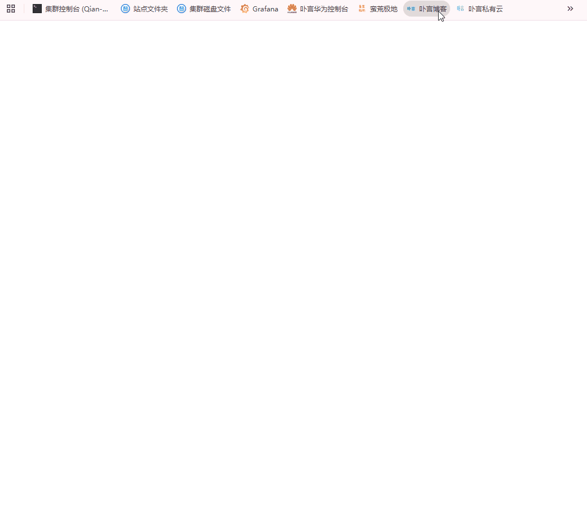

# OpenResty/Nginx Lua 人机验证防护模块

基于 OpenResty/Nginx Lua 的人机验证（CAPTCHA）防护模块，集成 Buyan-Captcha 服务，用于防护恶意自动程序和爬虫攻击。

## 功能特性

- **智能人机验证**：集成 Buyan-Captcha 验证服务，有效区分人类用户和机器程序
- **多种验证模式**：
  - `none` - 自动显示验证码
  - `auto` - 无感验证模式
  - `#id` / `.class` - 监听指定页面元素触发验证
- **验证状态缓存**：验证通过后设置 Cookie + 共享内存缓存，有效期内免重复验证（默认7天）
- **可扩展架构**：验证策略和页面样式均可自定义修改
- **智能路径排除**：支持正则表达式排除静态资源、图片等无需验证的路径
- **灵活错误处理**：支持配置 Token 获取失败或验证失败时的处理策略
- **响应式验证页面**：美观的验证界面，支持移动端适配
- **多语言支持**：自动识别用户语言偏好，支持简繁中文、英语、日语、韩语

## 效果展示



## 快速开始

### 1. 安装要求
- OpenResty >= 1.15.8 或 Nginx + lua-nginx-module
- 启用 `ngx_lua` 模块
- 配置 `lua_shared_dict limit 10m;`（用于验证状态缓存）

### 2. 配置说明
编辑 `config.lua` 文件，根据需要修改配置参数。

- 配置参数详解

| 参数名 | 类型 | 默认值 | 说明 |
|--------|------|--------|------|
| `BuyanCaptchaEnable` | string | "off" | 是否启用验证码，"on" 开启，"off" 关闭 |
| `BuyanAppId` | string | - | Buyan-Captcha 服务的 App ID（必填） |
| `BuyanClickMode` | string | "none" | 点击模式：`none`自动显示/`auto`无感/`#id`元素ID/`.class`类名 |
| `BuyanTokenFailAction` | string | "error" | Token获取失败时：`error`显示错误页/`pass`直接放行 |
| `BuyanVerifyFailAction` | string | "error" | 验证接口失败时：`error`返回验证失败/`pass`直接放行 |
| `BuyanVerifyCookieName` | string | "_buyan_captcha_verify" | 验证通过后的 Cookie 名称 |
| `BuyanVerifyExpireTime` | number | 604800 | 验证通过有效期，单位秒（默认7天） |
| `BuyanCaptchaLanguage` | string | "zh-CN" | 默认界面语言，支持多语言自动识别 |
| `BuyanCaptchaExcludePaths` | table | {} | 排除验证的路径正则表达式列表 |

#### 多语言配置
模块支持多语言界面，自动根据用户语言偏好显示对应语言的验证页面。

**支持的语言**：

| 语言代码 | 语言 | 语言识 |
|----------|------|------------|
| `zh-CN` | 简体中文 | zh, zh-CN |
| `zh-TW` | 繁体中文 | zh-TW, zh-HK |
| `en` | English | en, en-US, en-GB |
| `ja` | 日本語 | ja, ja-JP |
| `ko` | 한국어 | ko, ko-KR |

**配置示例**：
```lua
-- 设置默认语言（当无法自动识别时使用）
BuyanCaptchaLanguage = "en"  -- 默认为英文界面
```

### 3. Nginx 配置
在 Nginx 配置文件的 `http` 块中添加全局 Lua 配置：
```nginx
http {
    # Lua 模块搜索路径（根据实际安装路径调整）
    lua_package_path "/www/server/waf/?.lua;/www/server/nginx/lib/lua/?.lua;;";
    
    # 定义共享内存字典（用于缓存验证状态）
    lua_shared_dict limit 10m;
    
    # 初始化时预加载 Lua 模块（可选，提升性能）
    init_by_lua_file /www/server/waf/init.lua;
    
    server {
        listen 80;
        server_name example.com;
        
        location / {
            # 在访问上游服务器前执行验证码检查
            access_by_lua_file /www/server/waf/waf.lua;
            
            proxy_pass http://your_backend;
        }
    }
}
```

#### 路径调整示例

根据你的实际安装路径修改配置：

```nginx
# 如果安装在 /opt/splitcaptcha/
lua_package_path "/opt/splitcaptcha/?.lua;/usr/local/nginx/lib/lua/?.lua;;";
init_by_lua_file /opt/splitcaptcha/init.lua;
access_by_lua_file /opt/splitcaptcha/waf.lua;

# 如果安装在 /usr/local/openresty/nginx/conf/waf/
lua_package_path "/usr/local/openresty/nginx/conf/waf/?.lua;;";
init_by_lua_file /usr/local/openresty/nginx/conf/waf/init.lua;
access_by_lua_file /usr/local/openresty/nginx/conf/waf/waf.lua;
```

## 工作原理
```
用户请求
    │
    ▼
┌─────────────────┐
│  检查是否为排除路径  │──Yes──▶ 直接放行
└─────────────────┘
    │ No
    ▼
┌─────────────────┐
│ 检查验证Cookie是否  │──Yes──▶ 直接放行
│ 存在且未过期       │
└─────────────────┘
    │ No
    ▼
┌─────────────────┐
│  显示验证码页面    │◀──── 用户完成验证 ────┐
└─────────────────┘                          │
    │                                        │
    ▼                                        │
┌─────────────────┐     验证成功              │
│  服务端二次验证    │─────────────────────────┘
└─────────────────┘
    │ 验证失败
    ▼
  刷新页面重试
```

## 自定义扩展

### 验证策略自定义

默认使用 **Cookie + 共享内存** 进行验证状态管理，你可以根据需要修改验证策略：

| 验证方式 | 修改位置 | 说明 |
|----------|----------|------|
| Cookie 验证 | `init.lua` 中的 `is_verified()` 函数 | 修改 Cookie 名称、读取逻辑 |
| 内存缓存 | `init.lua` 中的 `set_verified()` 函数 | 改用 Redis/MySQL 等持久化存储 |
| 验证逻辑 | `init.lua` 中的 `handle_request()` 函数 | 自定义验证流程和规则 |

**示例：改用 Redis 存储验证状态**
```lua
-- 在 set_verified() 函数中，将 ngx.shared.limit 替换为 Redis
local redis = require "resty.redis"
local red = redis:new()
red:connect("127.0.0.1", 6379)
red:setex(cache_key, VERIFY_EXPIRE_TIME, "1")
```

### 验证页面自定义

验证页面 HTML 由 `generate_captcha_page()` 函数生成，你可以：

1. **修改页面样式**：编辑 `init.lua` 中的 CSS 样式部分（`<style>` 标签内）
2. **调整页面布局**：修改 HTML 结构部分
3. **更换配色方案**：修改 CSS 中的颜色值，如将 `#667eea` 改为你品牌的主色调
4. **添加自定义 Logo**：在 HTML 中添加 `` 标签引入你的 Logo

**主要样式变量位置**：
- 主题色：`#667eea`（渐变起始色）、`#764ba2`（渐变结束色）
- 错误色：`#e74c3c`
- 背景色：`#f3f3f3`
- 圆角大小：`20px`（容器）、`25px`（按钮）

## 注意事项

1. **必须配置 AppId**：`BuyanAppId` 必须设置为有效的 Buyan-Captcha App ID，否则验证码无法正常工作

2. **共享内存配置**：确保在 nginx.conf 中配置了 `lua_shared_dict limit 10m;`，用于存储验证状态

3. **SSL 配置**：模块默认使用 HTTPS 与 Buyan-Captcha 服务通信，请确保 OpenResty 支持 SSL

4. **路径排除**：默认已排除静态资源路径（CSS、JS、图片、字体、音视频等），这些请求不会触发人机验证。如需调整排除规则，请修改 `config.lua` 中的 `BuyanCaptchaExcludePaths` 配置

5. **Cookie 安全**：验证通过的 Cookie 设置了 `HttpOnly` 和 `Secure` 属性，请确保站点使用 HTTPS

## 故障排查

### 验证码页面无法加载

- 检查 `BuyanAppId` 是否正确配置
- 查看 Nginx 错误日志确认 API 连接是否正常
- 确认服务器可以访问 `BuyanCaptchaApiUrl`

### 验证通过后仍反复跳转

- 检查 `lua_shared_dict limit` 是否已配置
- 确认浏览器是否启用了 Cookie
- 检查 Cookie 的 Domain 设置是否与访问域名匹配

### 静态资源被拦截

- 在 `BuyanCaptchaExcludePaths` 中添加对应的路径排除规则
- 使用正则表达式匹配文件扩展名或目录

## 日志记录

模块会记录以下级别的日志：

- `ngx.INFO` - 模块加载、请求处理状态
- `ngx.ERR` - 错误信息（API 连接失败、Token 获取失败等）
- `ngx.WARN` - 警告信息（降级放行等）

查看日志排查问题：
```bash
tail -f /var/log/nginx/error.log | grep -i "Buyan-Captcha"
```

## 风险拦截优化

### 背景

默认情况下，每个用户第一次访问都会显示验证码。如果您希望优化用户体验，可以先通过 IP 威胁情报判断是否存在风险，只对有风险的 IP 显示人机验证页面。

### IP 威胁情报接口

网络上有很多免费或付费的 IP 威胁情报服务。这里提供一个免费的接口：

**请求地址**：`https://qaqbuyan.com:88/乔安模块/?mk=risk&ip=?`

**请求方式**：GET

**参数说明**：

| 参数 | 说明 |
|---|---|
| ip | 需要查询的 IP 地址 |

**返回示例**：

```json
{
    "code": 200,
    "message": {
        "ip": "223.207.119.49",
        "risk_ip": true,
        "message": ""
    }
}
```

**返回说明**：

| 字段 | 说明 |
|---|---|
| code | 请求状态，200 为成功 |
| message.ip | 查询的 IP 地址 |
| message.risk_ip | 是否为风险 IP，true 表示有风险 |
| message.message | 附加信息 |

### 实现示例

在 `init.lua` 中添加 IP 风险检查逻辑：

```lua
local function check_ip_risk(ip)
    local http = require "resty.http"
    local httpc = http.new()
    
    local res, err = httpc:request_uri("https://qaqbuyan.com:88/乔安模块/", {
        method = "GET",
        query = {
            mk = "risk",
            ip = ip
        },
        ssl_verify = false,
        timeout = 3000
    })
    
    if not res then
        ngx.log(ngx.ERR, "IP risk check failed: ", err)
        return false
    end
    
    local data = cjson.decode(res.body)
    if data.code == 200 and data.message.risk_ip then
        return true
    end
    
    return false
end
```

在 `handle_request()` 函数中调用：

```lua
local function handle_request()
    local ip = ngx.var.remote_addr
    
    -- 先检查 IP 是否有风险
    local is_risk = check_ip_risk(ip)
    
    if not is_risk then
        -- 无风险，直接放行
        return
    end
    
    -- 有风险，继续验证码流程
    if is_verified() then
        return
    end
    
    -- 显示验证码页面
    generate_captcha_page()
end
```

### 优化建议

1. **缓存结果**：将 IP 风险检查结果缓存到共享内存或 Redis，避免重复请求

```lua
local function check_ip_risk_cached(ip)
    local cache = ngx.shared.limit
    local cache_key = "risk:" .. ip
    local cached = cache:get(cache_key)
    
    if cached ~= nil then
        return cached == "1"
    end
    
    local is_risk = check_ip_risk(ip)
    cache:set(cache_key, is_risk and "1" or "0", 3600)  -- 缓存1小时
    return is_risk
end
```

2. **超时设置**：设置合理的超时时间，避免影响用户体验

3. **降级策略**：当威胁情报服务不可用时，可以选择直接放行或显示验证码

4. **白名单机制**：对于已知的可信 IP 段（如内部网络），可以跳过风险检查

## 技术支持

- 官方文档：https://qaqbuyan.com:88/buyan_captcha_intro.html
- 隐私政策：https://qaqbuyan.com:88/buyan_captcha_privacy.html